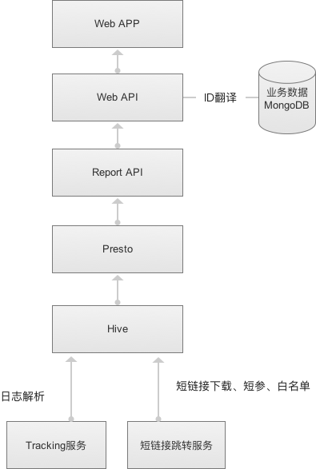
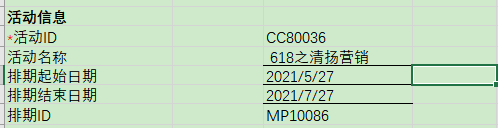

# Analytics是如何玩的？

[TOC]

Analytics为一款应用工具，为您提供全链路的营销分析和评估，主要特点为：

- 多渠道数据采集和分析

> 通过不同营销渠道中的数据，了解客户的信息及其跨渠道互动情况。

- 追溯式事件处理

> 通过转化目标的分析，回溯客户在相对的时间跨度内的行为变化。

- 基于规则的归因

> 配置不同的归因规则，以分析企业与客户的每次营销互动对最终转化的影响力。

同时，搭配使用套件中的另一款基础工具——Data Platform，协助定制化地接入和配置营销数据，为后续的分析及应用提供结构化的数据基础。

## Aanalytics 内部结构图 




## 前端操作流程

### 活动监测

1. 新建活动

2. 上传排期
   - 下载排期模板
   - 修改【活动ID】【活动名称】
   	 
   - 上传排期
   
3. 修改排期的相关信息

4. 下载监测代码

   - 查看排期代码

     ```
     https://tracking.ccd86.com/p?ev=type:ai&acid=datahub_dev&on=cpid:CC80036,cid:4,mpid:MP10086,adfmt:9&at=aid:1,mdm:display,src:1,pubid:1,mdmdt:pc
     ```

     - tracking的服务器的ip地址是否已经更改
       - 没有， 请运维部署tracking服务器
       - 拿到tracking服务器的域名
     - ACID是否定义好
       - dev环境是`chiefclouds-dev` 
       -  dev2是`chiefclouds-dev2`
     - dev的tracking服务
       - http://web-dev.chiefclouds.com:9099
       - http://web-dev2.chiefclouds.com:9099

5. 部署监测代码

6. 收取数据并解析（Analytics的结构图）

7. 活动报告展示

#### 问题描述

1. 关联站点在哪里设置？

2. 目标在哪里设置？

   


