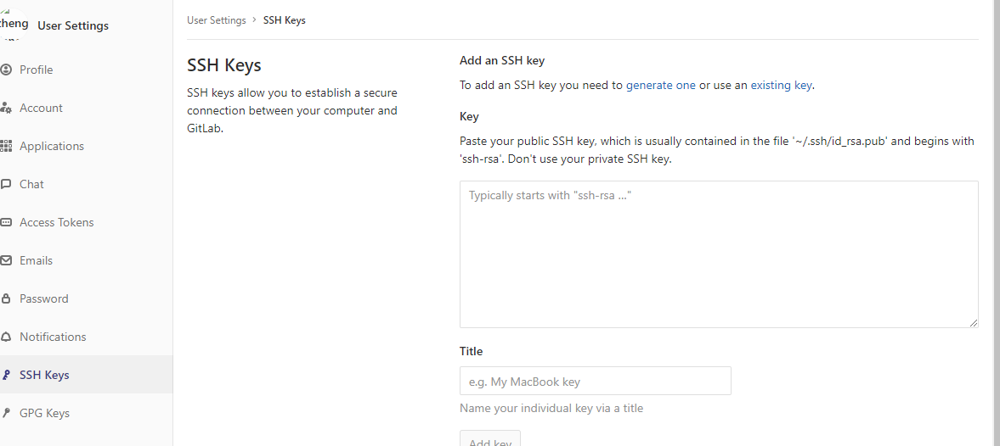

# Git精粹

[TOC]

## Git使用SSH访问

### Windows

1. 删除用户文件夹下`.ssh`文件夹

2. 打开git cmd， 设置用户名和邮箱

   ```shell
   EDZ@WIN-2QINK1GUNEC MINGW64 ~
   $ git config --global user.name "zhengrong jiang"
   
   EDZ@WIN-2QINK1GUNEC MINGW64 ~
   $ git config --global user.email "zhengrong.jiang@chiefclouds.com"
   ```
   
3. 查看用户名和邮箱的设置
	```shell
	EDZ@WIN-2QINK1GUNEC MINGW64 ~
    $ git config user.name
    zhengrong jiang

    EDZ@WIN-2QINK1GUNEC MINGW64 ~
    $ git config user.email
    zhengrong.jiang@chiefclouds.com
	```
	
4. 生成一个密钥

	```shell
	EDZ@WIN-2QINK1GUNEC MINGW64 ~
	$ ssh-keygen -t rsa -C "zhengrong.jiang@chiefclouds.com"
	```
	连续敲三次回车， 生成一个密钥

5. 用户下面生成的rsa_pub的内容复制到gitlab设置中SSH-KEYS
	
	
	
	

