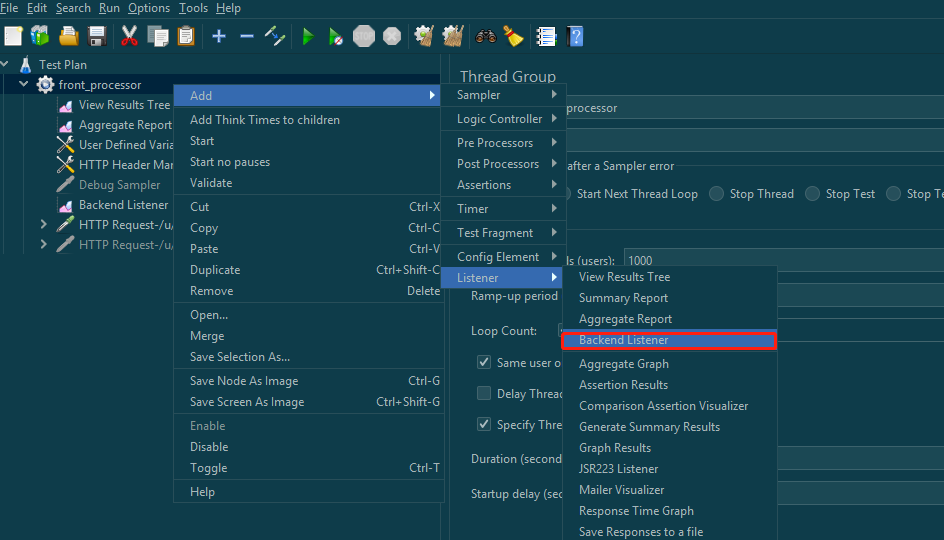
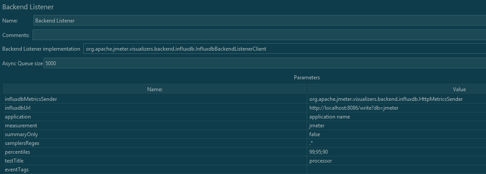

# 如何进行压测?

[TOC]

## Java安装

1. 下载openjdk

   ```
   wget https://download.java.net/java/GA/jdk11/13/GPL/openjdk-11.0.1_linux-x64_bin.tar.gz
   ```

2. 安装openjdk

   ```
   mkdir /usr/local/jdk
   tar -zxf  openjdk-11.0.1_linux-x64_bin.tar.gz -C /usr/local/jdk
   ```
3. 配置环境变量

	- 配置Java home
		```
		mkdir /usr/local/jdk
		tar -zxf  openjdk-11.0.1_linux-x64_bin.tar.gz -C /usr/local/jdk
		```
	- 配置Path环境变量
		```
		 echo "PATH=$PATH:$JAVA_HOME/bin" | sudo tee -a ~/.bash_profile \
 &&echo "export PATH" | sudo tee -a ~/.bash_profile \
 &&source ~/.bash_profile  
		```

4. 验证是否安装成功

   ```
   [root@iZ0jl3ofdembvcn7k88vpjZ jdk]# java --version
   openjdk 11.0.1 2018-10-16
   OpenJDK Runtime Environment 18.9 (build 11.0.1+13)
   OpenJDK 64-Bit Server VM 18.9 (build 11.0.1+13, mixed mode)
   ```

## JMeter安装

1. 下载JMeter

   ```
   wget https://mirrors.tuna.tsinghua.edu.cn/apache//jmeter/binaries/apache-jmeter-5.4.1.tgz
   ```

2. 安装Jmeter

   ```
   mkdir /usr/local/jmeter
   tar -zxf apache-jmeter-5.4.1.tgz /usr/local/jmeter
   ```

3. 配置环境变量

   - 用vi打开`/etc/profile`

   - 写入如下的变量
		```
     JMETER=/usr/local/jmeter/apache-jmeter-5.4.1
   CLASSPATH=$JMETER/lib/ext/ApacheJMeter_core.jar:$JMETER/lib/jorphan.jar:$JMETER/lib/logkit-2.0.jar:$CLASSPATH
     PATH=$PATH:$JMETER/bin
     export JMETER PATH
     ```
   - `source /etc/profile`

4. 验证是否安装成功

   ```
   jmeter --version
   Apr 09, 2021 7:37:50 PM java.util.prefs.FileSystemPreferences$1 run
   INFO: Created user preferences directory.
       _    ____   _    ____ _   _ _____       _ __  __ _____ _____ _____ ____
      / \  |  _ \ / \  / ___| | | | ____|     | |  \/  | ____|_   _| ____|  _ \
     / _ \ | |_) / _ \| |   | |_| |  _|    _  | | |\/| |  _|   | | |  _| | |_) |
    / ___ \|  __/ ___ \ |___|  _  | |___  | |_| | |  | | |___  | | | |___|  _ <
   /_/   \_\_| /_/   \_\____|_| |_|_____|  \___/|_|  |_|_____| |_| |_____|_| \_\ 5.4.1
   
   Copyright (c) 1999-2021 The Apache Software Foundation
   ```

## 性能监控平台部署

### Influx DB 部署

#### influx DB安装

1. Influx的DB安装首先需要修改安装源：

   - 在`/etc/yum.repos.d/`路径下新建`influxdb.repo`

   - 放入如下的配置

     ```
     [influxdb]
     name = InfluxDB Repository - RHEL \\$releasever
   baseurl = https://repos.influxdata.com/rhel/$releasever/\$basearch/stable
     enabled = 1
     gpgcheck = 1
     gpgkey = https://repos.influxdata.com/influxdb.key
     ```

2. 使用Yum安装
  ```
  yum install -y influxdb
  ```

#### Influx DB的配置

1. 创建数据库

   ```
   influx
   [root@iZ0jl3ofdembvcn7k88vpjZ ~]# influx
   Connected to http://localhost:8086 version 1.8.4
   InfluxDB shell version: 1.8.4
   > create database jmeter
   > show database;
   name: databases
   name
   ----
   _internal
   jmeter
   ```


### JMeter的配置

1. 在JMeter中添加 Backend Listener 组件，用于收集数据并发送给influxdb

   

2. 在Backend Listener implementation 中选择InfluxdbBackendListenerClient

3. 编辑hostname和设定名字

4. 最后配置参考图

   


### Granfa的部署

#### Granfa的安装

1. 下载并安装Granfa

   ```
   wget https://dl.grafana.com/oss/release/grafana-7.5.3-1.x86_64.rpm
   rpm -ivh grafana-7.5.3-1.x86_64.rpm
   ```

2. 开机启动Granfa

   ```
   sudo /bin/systemctl daemon-reload
   sudo /bin/systemctl enable grafana-server.service
   sudo /bin/systemctl start grafana-server.service
   
   systemctl restart grafana-server
   systemctl enable grafana-server
   ```


#### Granfa的部署

1. 使用服务器的ip地址：http://{安装granfa的ip地址}:3000/?orgId=1
2. 默认用户名密码： admin/admin
3. 设置datasource： Config -> Add Data Source -> Influx DB

## JMeter压测命令

### 介绍

通常情况下， 不能使用Jmeter GUI来进行压测， 一般使用Jmeter命令行进行压测

### JMeter命令行的使用

```
jmeter -n -t front_uqj.jmx -l result.jtl -e -o result1.html
```

### 自动化压测脚本

1. 在模板的jmx文件中， 

```sh
#!/usr/bin/env bash

# 压测脚本模板中设定的压测时间应为60秒
export jmx_template="front_machine_template"
export suffix=".jmx"
export jmx_template_filename="${jmx_template}${suffix}"
export os_type=`uname`

# 需要在系统变量中定义jmeter根目录的位置，如下
export jmeter_path="/usr/local/jmeter/apache-jmeter-5.4.1"

echo "自动化压测开始"

# 压测并发数列表
thread_number_array=(100 350 600)
for num in "${thread_number_array[@]}"
do
    # 生成对应压测线程的jmx文件
    export jmx_filename="${jmx_template}_${num}${suffix}"
    export jtl_filename="test_${num}.jtl"
    export web_report_path_name="web_${num}"

    rm -f ${jmx_filename} ${jtl_filename}
    rm -rf ${web_report_path_name}

    cp ${jmx_template_filename} ${jmx_filename}
    echo "生成jmx压测脚本 ${jmx_filename}"

    if [[ "${os_type}" == "Darwin" ]]; then
        sed -i "" "s/thread_num/${num}/g" ${jmx_filename}
    else
        sed -i "s/thread_num/${num}/g" ${jmx_filename}
    fi

    # JMeter 静默压测
    ${jmeter_path}/bin/jmeter -n -t ${jmx_filename} -l ${jtl_filename}

    # 生成Web压测报告
    ${jmeter_path}/bin/jmeter -g ${jtl_filename} -e -o ${web_report_path_name}

    rm -f ${jmx_filename} ${jtl_filename}
done
echo "自动化压测全部结束"


```

## Apache Benchmark 压测

### 安装AB

### AB命令行说明

```
⚡ root@localhost  ~  ab -h
Usage: ab [options] [http[s]://]hostname[:port]/path
Options are:
    -n requests     Number of requests to perform
    -c concurrency  Number of multiple requests to make at a time
    -t timelimit    Seconds to max. to spend on benchmarking
                    This implies -n 50000
    -s timeout      Seconds to max. wait for each response
                    Default is 30 seconds
    -b windowsize   Size of TCP send/receive buffer, in bytes
    -B address      Address to bind to when making outgoing connections
    -p postfile     File containing data to POST. Remember also to set -T
    -u putfile      File containing data to PUT. Remember also to set -T
    -T content-type Content-type header to use for POST/PUT data, eg.
                    'application/x-www-form-urlencoded'
                    Default is 'text/plain'
    -v verbosity    How much troubleshooting info to print
    -w              Print out results in HTML tables
    -i              Use HEAD instead of GET
    -x attributes   String to insert as table attributes
    -y attributes   String to insert as tr attributes
    -z attributes   String to insert as td or th attributes
    -C attribute    Add cookie, eg. 'Apache=1234'. (repeatable)
    -H attribute    Add Arbitrary header line, eg. 'Accept-Encoding: gzip'
                    Inserted after all normal header lines. (repeatable)
    -A attribute    Add Basic WWW Authentication, the attributes
                    are a colon separated username and password.
    -P attribute    Add Basic Proxy Authentication, the attributes
                    are a colon separated username and password.
    -X proxy:port   Proxyserver and port number to use
    -V              Print version number and exit
    -k              Use HTTP KeepAlive feature
    -d              Do not show percentiles served table.
    -S              Do not show confidence estimators and warnings.
    -q              Do not show progress when doing more than 150 requests
    -g filename     Output collected data to gnuplot format file.
    -e filename     Output CSV file with percentages served
    -r              Don't exit on socket receive errors.
    -h              Display usage information (this message)
    -Z ciphersuite  Specify SSL/TLS cipher suite (See openssl ciphers)
    -f protocol     Specify SSL/TLS protocol
                    (SSL3, TLS1, TLS1.1, TLS1.2 or ALL)

```


### 具体场景

1. SLB

   - 验证请求
   
	```
   curl -i -X POST -H 'Content-type':'application/json' -d '{"deviceId":"AEBE02E7-03EE-455A-XXX-11","deviceType":"IDFA","segmentIds":["35"]}' http://172.20.112.199:9000/u/q/j
   ```

   - AB测试

	```
   ab -n 50000 -c 100 -p post.txt -T "application/json" http://172.20.112.199:9000/u/q/j
   ab -n 500000 -c 100 -p post.txt -T "application/json" http://172.20.112.199:9000/u/q/j
   ab -n 5000000 -c 100 -p post.txt -T "application/json" http://172.20.112.199:9000/u/q/j
   ab -n 50000000 -c 100 -p post.txt -T "application/json" http://172.20.112.199:9000/u/q/j
   ab -n 100000000 -c 100 -p post.txt -T "application/json" http://172.20.112.199:9000/u/q/j
	```

2. 单点服务器
   - 验证请求

    ```
    curl -i -X POST -H 'Content-type':'application/json' -d '{"deviceId":"AEBE02E7-03EE-455A-XXX-11","deviceType":"IDFA","segmentIds":["35"]}' http://172.28.36.73:9000/u/q/j
    ```

    - AB测试

    ```
    ab -n 50000 -c 100 -p post.txt -T "application/json" http://172.28.36.72:9000/u/q/j
    ```


## 经验和教训
1. 压测的机器的性能不能比待测的机器差， 不然， Jmeter压测的进程数不能被很好的模拟
2. 先使用请求数和进程数， 得出压测时间， 然后用到Jmeter当中去。