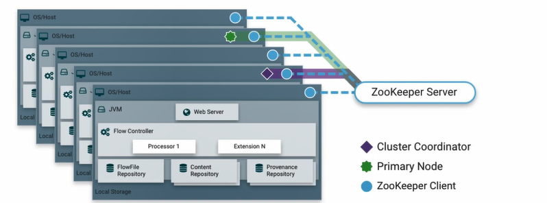

# 深入浅出 Nifi

[TOC]

## Nifi是什么

### 简介

- Apache NiFi 是一个易于使用、功能强大而且可靠的数据拉取、数据处理和分发系统，用于自动化管理系统间的数据流。
- 它支持高度可配置的指示图的数据路由、转换和系统中介逻辑，支持从多种数据源动态拉取数据。
- NiFi原来是NSA(National Security Agency [美国国家安全局])的一个项目，目前已经代码开源，是Apache基金会的顶级项目之一
- NiFi基于Web方式工作，后台在服务器上进行调度。
- 用户可以为数据处理定义为一个流程，然后进行处理，后台具有数据处理引擎、任务调度等组件。

### dataflow的挑战

- system fail
- Data access exceeds capacity to consume
- Boundary conditions are mere suggestions
- What is nosie one day become signal the next
- Systems evolve at different rates
- Compliance and security
- Continous improvment occur in production

### 特点

1. 高可用
2. 高并发
3. 错误纠察
4. 快速响应
5. 安全
6. 方便迁移

## NIFI核心概念

- Nifi 的设计理念接近于基于流的编程 Flow Based Programming。
- FlowFile：表示通过系统移动的每个对象，包含数据流的基本属性
- FlowFile Processor（处理器）：负责实际对数据流执行工作
- Connection（连接线）：负责不同处理器之间的连接，是数据的有界缓冲区
- Flow Controller（流量控制器）：管理进程使用的线程及其分配
- Process Group（过程组）：进程组是一组特定的进程及其连接，允许组合其他组件创建新组件

此设计模型也类似于seda（分阶段），带来了很多好处，有助于NiFi成为非常有效的、构建功能强大且可扩展的数据流的平台。其中一些好处包括：

- 有助于处理器有向图的可视化创建和管理
- 本质上是异步的，允许非常高的吞吐量和足够的自然缓冲
- 提供高并发的模型，开发人员不必担心并发的复杂性
- 促进内聚和松散糊合组件的开发，然后可以在其他环境中重复使用并方便单元测试
- 资源受限的连接流程中可配置connections）使得背压和压力释放等关键功能非常自然和直观
- 错误处理变得像基本逻辑一样自然，而不是粗粒度的全部捕获（catch-all）
- 数据进入和退出系统的点，以及它是如何流动的，都是容易理解和跟踪的

## NIFI架构

### NIFI单节点

- Web Server（网络服务器）
  - web服务器的目的是承载Nii基于http的命令和控制APl。
- Flow Controller（流控制器）
  - 是整个操作的核心，为将要运行的组件提供线程，管理调度。
- Extensions（扩展）
  - 有各种类型的E扩展，这些扩展在其他文档中进行了描述。这里的关键点是E扩展在MM中操作和执行。
- FlowFile Repository（流文件存储库）
  - 对于给定一个流中正在活动的FlowFile，FlowEile Repository就是NI保持跟踪这个FlowElle状态的地方。
- ElowFile Repository的实现是可插拔的（多种选择，可配置，甚至可以自己实现），默认实现是使用Write-Ahead Log技术（简单普及下，WAL的核心思想是：在数据写入库之前，先写入到日志.再将日志记录变更到存储器中。）写到指定磁盘目录。
- Content Repository（内容存储库）
  - Content Repository是给定FlowFile的实际内容字节存储的地方。Content Repository的实现是可插拔的。默认方法是一种相当简单的机制，它将数据块存储在文件系统中。可以指定多个文件系统存储位置，以便获得不同的物理分区以减少任何单个卷上的争用。（所以坏境最佳实践时可配置多个目录，挂载不同磁盘，提高IO）
- Provenance Repository（源头存储库）
  - Provenance Repository是存储所有事件数据的地方。Provenance Repository的实现是可插拔的，默认实现是使用一个或多个物理磁盘卷。在每个位置内的事件数据都是被索引并可搜索的。

### NIFI集群

